# FIN 566 Algorithmic Trading Final Report

# Table of Contents

- [FIN 566 Algorithmic Trading Final Report](#fin-566-algorithmic-trading-final-report)
- [Table of Contents](#table-of-contents)
- [Introduction](#introduction)
- [Background](#background)
  - [Glossary of Terms](#glossary-of-terms)
  - [Components and Symbols Chosen](#components-and-symbols-chosen)
  - [Description of the Data Used](#description-of-the-data-used)
- [Implementation and Analysis](#implementation-and-analysis)
  - [General Overview of Our Strategy](#general-overview-of-our-strategy)
  - [Pre-Implementation Research](#pre-implementation-research)
    - [Correlation Plots](#correlation-plots)
    - [Time Series Plots](#time-series-plots)
    - [Analysing Trade Intervals for Consecutive Trades](#analysing-trade-intervals-for-consecutive-trades)
    - [Regression Results](#regression-results)
  - [C++ Implementation:](#c-implementation)
    - [Algorithm:](#algorithm)
    - [Parameter Tuning Results](#parameter-tuning-results)
    - [Results and P&L on unseen Q1 2020 Data:](#results-and-pl-on-unseen-q1-2020-data)
  - [Post-Backtesting analysis](#post-backtesting-analysis)
  - [Complementary Analysis: What is the source of profitability?](#complementary-analysis-what-is-the-source-of-profitability)
- [Conclusion:](#conclusion)
- [Troubleshooting](#troubleshooting)
- [Contributions and Next Steps](#contributions-and-next-steps)
- [References](#references)

# Introduction

In our final project, we attempt to devise a trading strategy that we can backtest on real market data from a stock exchange. In the following report, we go through the different steps involved in the process, from analyzing the raw market data, looking at correlations between different stocks and finally coming up with, and implementing a trading strategy. We used a popular backtesting engine, strategy studio, to write and test our strategy.

# Background

## Glossary of Terms

Below are a cumulative list of technical terms and abbreviations that is seen in this report with a brief overview and history of the specifed term.

1. **Index**: An index is a method to track the performance of some group of assets in a standardized way. Indices typically measure the performance of a basket of securities intended to replicate a certain area of the market. These may be broad-based to capture the entire market such as the Standard & Poor's 500 (S&P 500), National Association of Securities Dealers Automated Quotations (NASDAQ) or Dow Jones Industrial Average (DJIA), or more specialized such as indices that track a particular industry or segment.
2. **ETF**: An exchange traded fund is a type of security that involves a collection of securities - such as stocks (all of the shares into which ownership of the corporation is divided), commodities, or bonds (an instrument of indebtedness of the bond issuer to the holders.), that tracks an underlying index , although they can invest in any number of industry sectors or use various strategies. ETFs are in many ways similar to mutual funds; however, they are listed on exchanges and ETF shares trade throughout the day just like ordinary stock. ETFs offer low expense ratios (expense ratio of a stock or asset fund is the total percentage of fund assets used for administrative, management, advertising, and all other expenses) and fewer broker commissions than buying the stocks individually. The ETF we have used here for our strategy is SPY that tracks the S&P 500 index. There are many other ETFs like DIA that tracks the Dow Jones index, QQQ that tracks the NASDAQ index, etc.

3. **Backtesting**:

    $$ Alert: Finish this section$$$

4. **IEX**: 

## Components and Symbols Chosen

Our analysis and strategy involved the following tickers: 

1. SPY (S&P 500 ETF)
2. AAPL (Apple Inc.,)
3. MSFT (Microsoft Corporation)
4. JPM (JP Morgan Chase & Co.)
5. INTC (Intel Corporation).

## Description of the Data Used

Our input data consisted of the following columns: collection_time, source_time, sequence_number, tick_type, market_center (the exchange on which the trading happens - we use data from IEX so the market_center is always IEX), price (the last trading price of the stock or index or ETF), size and ticker.

We used data for the month of October 2019 to train, devise, and analyze our strategy. To further confirm that our strategy does indeed work and was not overfit on the training data, we ran multiple backtests on trading data from Q1 of 2020. (January, February, March)

# Implementation and Analysis

## General Overview of Our Strategy

Our proposed strategy takes advantage of the complementary movement between an index’s ETF and its components. It resembles the so-called pair trading strategy, generating profits from the statistical correlation and causal relationships between an index’s ETF and its components. The main advantage of an ETF-component pair is that both instruments represent the value of the same assets, and a result, leads to strong correlations between price movements. More specifically, we select an ETF which tracks the S&P 500 (ticker symbol: SPY) and its top components as the symbols to trade on. Compared with other indices, S&P 500 and its ETF are one of the most liquid and most-cited market indices. Since it is a cap-weight index, equities of large market capitalization have stronger influence on the index values, leading to stronger correlations. By the same logic, small-cap companies are less weighted and thus bear weaker influence on the index.

Ideally, since an ETF represents the values of a set of underlying assets, the value of the ETF and components’ price should move simultaneously. Even in an imperfect market, one may expect the components to respond to new information faster than the ETF does, since an ETF is nothing but a basket of component stocks. However, counterintuitively, it is well observed that index ETF, especially the most liquid ones, usually responds first with any new information. In other words, the ETF acts as a leading indicator for its components, instead of the other way around. 

The existence of this leading effect makes our strategy different from common pair trading, where traders monetize deviations in price of the pairs in both-direction. However, we monetize the leading effect of the ETF on its components. Our analysis shows ETF’s price is an effective short-term predictor for prices of its top components. More specially, the upward movements in an ETF are statistically followed by upward movement of its top components. So are the downward movements. Our proposed strategy is based on such a leading effect: we build long positions on components when we observe the ETF goes up by a tuned threshold value, wait for components to catch up and then liquidate the position. The same logic applies to the downward situation. 

The backtest results verify our analysis and show our strategy is a money maker under our ideal backtesting environment. Although our backtesting environment is unrealistic and doesn’t control all of the practical issues in the real world, the results clearly demonstrate the existence of such leading effects and point out the future direction on related real-world trading strategies. 

## Pre-Implementation Research

### Correlation Plots

Correlations of different components (AAPL, AMZN, MSFT, JPM, INTC, SPY) with each other is as follows:

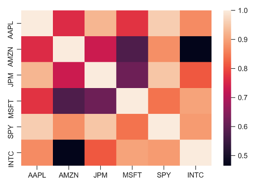

We selected all components in this correlation except AMZN as it has less correlation with the others and also since it’s not one of the highest weighted components of SPY.

### Time Series Plots

Time Series plot of each ticker was done separately. We chose the five highest weighted components of SPY. The five tickers used for this plot are: AAPL, AMZN, INTC, JPM and MSFT. The plot is as follows:

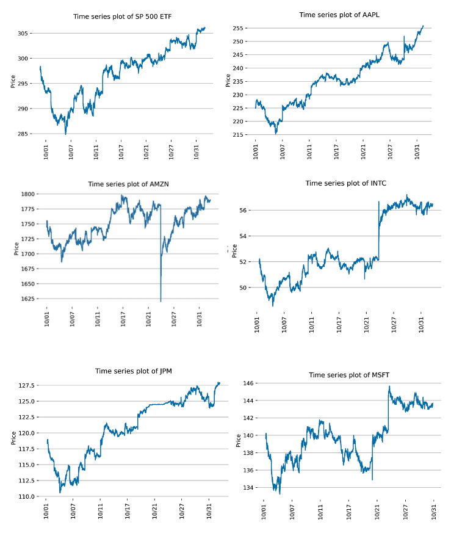

From the above plot, we can see that AAPL, JPM and SPY closely mimic each other, whereas the others do not have much closeness according to the plot. Our plot from correlation also confirm that AAPL and SPY are closely related.

### Analysing Trade Intervals for Consecutive Trades

Although our aim is to predict future price movement, the issue is the time span. As such, before diving into intriguing prediction analysis, we first analyze the time interval between two consecutive trades, which provide useful information on the frequency of trade. We rely on the analysis in this section to help us choose the proper time window for future return and historical returns in the next section. To proceed, we calculate the time interval between two consecutive trades for the whole sample period and different tickers. We summarize the information by plotting out the percentiles of resulting time intervals. The result is as follows. 

As shown in the results, roughly 40% of two consecutive trades of 4 components occur within 1 second, and 55% consecutive trades of SPY occur within 1 second. Within 1 second, only 30% of trades occur within 0.1 second, and the number of qualified trades decrease steadily as time interval shortens. On the contrary, the number of trades decreases much faster beyond 1 second. The results imply the trades are clustering, traders trade actively when there are opportunities, but can keep silent for long time periods. 

$$ ALERT: ADD IMAGE HERE$$$

### Regression Results

We make use of the statistical tool of regression to analyze the correlation between SPY’s movement and components’ movement. The aim of the regression analysis is to test whether historical price movement of SPY could predict the future price movement of its components. If the leading effect exists between SPY and its components, we expect to observe that the historical return of SPY is able to predict components’ future return in a consistent and persistent manner. 
The regression can be conducted with off-the-shelf toolkits. The issue remains is the choice of the time span of historical returns (features, independent variables) and future return (label, dependent variable). First of all, we would like to predict the short-term future return, since we want to liquidize the position and take the profit quickly. Holding the position for a longer time means less trade, or more principal. Usually, the time window of the features and labels should match to obtain the strongest prediction performance. According to analysis of trade intervals, extremely short time windows lead to the problem of collinearity, since it is highly possible that no trade occurs within all the selected windows. On the other hand, a longer time-window usually doesn’t have strong predictability on the short-term return. Based on the trade interval analysis and above logic, we choose two sets of features and labels to run the regression:

-  Long time window: future return in 1 seconds as label; historical returns for 1, 5, 10, 30 seconds as features.

-  Short time window: future return in 1 millisecond as label; historical returns for 1, 5, 10, 30 microseconds as features (data - the whole month)

1. **Long-Time Window**: 
   For the regression on the long-time window, we make use components’ 1-second future return as dependent variable. As for independent variables, we use both components’ and SPY’s historical returns of 1, 5, 10, 30 seconds. The results are compiled in the following table.
   
    As shown in the table, historical returns of SPY show strong and significant predictability for components’ future return in all of the 4 regressions. Even surprisingly, the coefficients are even larger than the component’s themselves. The results suggest that SPY’s historical returns are good predictors of components’ future performance, at least for the 1-second time span. For the sake of clarity, we only compile the regression results for one day, but we found the results are consistent and persistent during the whole month. 

    $$ ALERT: ADD TABLE HERE$$$

2. **Short Time Window**:
     -  **(0.001 seconds)**:

        $$ ALERT: ADD TABLE HERE$$$
    -  **(0.000001 seconds) Microseconds**:
        1. AAPL:

        $$ ALERT: ADD TABLE HERE$$$

## C++ Implementation:

### Algorithm:

In our main algorithm, we define a particular signal (In our case SPY), and an associated component that we wish to trade on (One of MSFT, AAPL, JPM, INTC). We then define an up and down threshold value, which are absolute figures in USD. Via parameter tuning, we found the best range for this threshold to be around $0.03 to $0.05, and hence our default threshold is $0.05. We have another tuning parameter which is the number of past trades to factor into the decision-making model. (Here the default is the past two trades). Lastly, we also define an aggressiveness value which determines the price at which we place the BUY or SELL order compared to the current market price.

On every trade, leveraging Strategy Studio’s onTrade API, we check if the current price of the signal (SPY) is greater than the price traded in the last 2 trades, and if so, we recognize the upward trend and send a BUY order for the last traded quantity of the component we want to trade on.

Similarly, once we have bought a certain quantity of shares, we hold it until we see a downward trend in the price of our signal (SPY) and if we see it go down by a given threshold, we send an order to SELL and liquidate or entire current position. This is how we close out our strategy.

To control the different states, and situations in our strategy, we leverage a Finite State Machine (FSM), with the following states, START, SENT_BUY, SENT_SELL, BUY, SELL, HOLD. These various states ensure that we don’t sell before we actually have bought certain stocks, and also that we don’t buy multiple times consecutively until our previous order has been completed. To do so, once we recognize a certain trend in our signal, we change our state machine to BUY, and then SENT_BUY or SELL, and then SENT_SELL and send an order to the exchange/backtesting engine. During a SELL order, we close out our entire current holdings. We then wait for Strategy Studio’s onOrderUpdate function where if we see a successful order, completed we transition to our next state. If our successful order was a SELL, we then go back to the start state indicating that we can now buy again, or if the last successful order was a BUY, we transition to the HOLD state to wait until we can liquidate our position. As readers might notice, this does mean that we alternate between buying and selling our component’s stock, and this seems to work well during our backtests.

Furthermore, we also have logic to prevent large losses, and hence exit our current position if we see a 5% drop from our last successful order to BUY, and we also exit our strategy and sell when we are up about 1% from our last successful order to BUY.

A couple of caveats that could be potentially dangerous and that we hope to modify in the future is that our strategy currently does not close out its entire position at the end of the day, and on multiple trading days, it’s possible that it holds shares overnight. Ideally, we don’t want to take such a risk, and hence add logic in our strategy which would close our position before market close on any given day.

### Parameter Tuning Results

Varying the threshold value and running the backtest for all the symbols, we see a ‘sweet spot’ in the $0.03 - $0.05 range where the profits were maximized. Any greater and the profitability reduced exponentially.

Negative aggressiveness, leads to losses (Hypothesis: Orders Not Filled).

Best Aggressiveness for all symbols was 0.00, always decreased P&L with more aggressive strategies

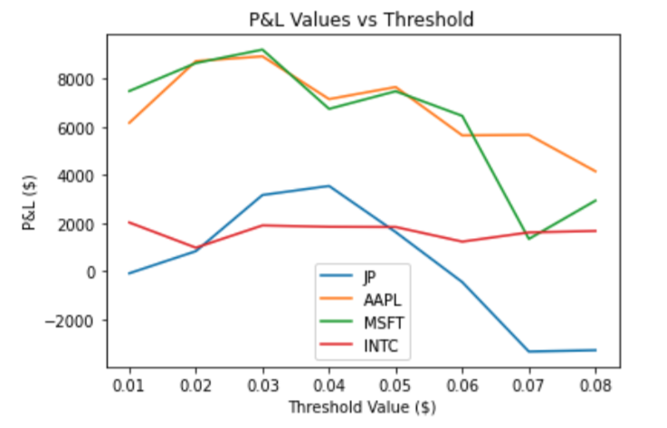

### Results and P&L on unseen Q1 2020 Data:

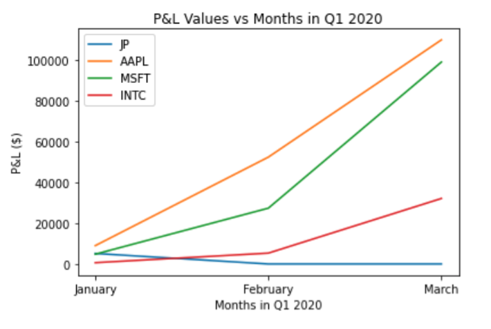

## Post-Backtesting analysis

From the output of the backtesting, we did different types of analysis like calculation of cumulative returns and other parameters like Sharpe ratio, volatility, Sortino Ratio,etc. The method we use to calculate the cumulative return rate is different from the cumulative return we get from the PnL csv file.
First, we created indicator variables to see if the trade was a buy or sell trade. Then, we calculated the simple return for each buy and sell transaction and got the cost and budget of such transaction. Then, divide the simple return by the cost and budget of the transaction, which we get the simple return rate. Finally, we get the cumulative return by cumulating all the simple return rates, where we assume the investment rate of return is compounded.

We calculated the Sharpe ratio by dividing the annualized return by the volatility. Sortino Ratio is calculated by return by the downside deviation. We have the following curves for cumulative returns of MSFT, AAPL, INTC and JPM using SPY as the signal to generate our trading.

1. **MSFT** :

    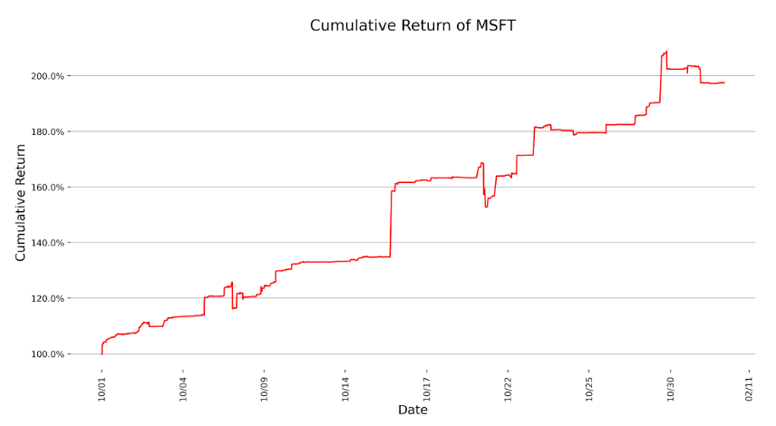
    <!--  -->

    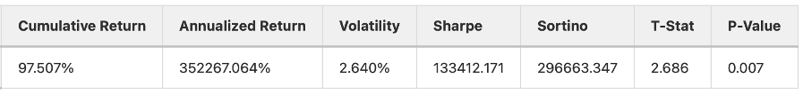

2. **AAPL** :
  
    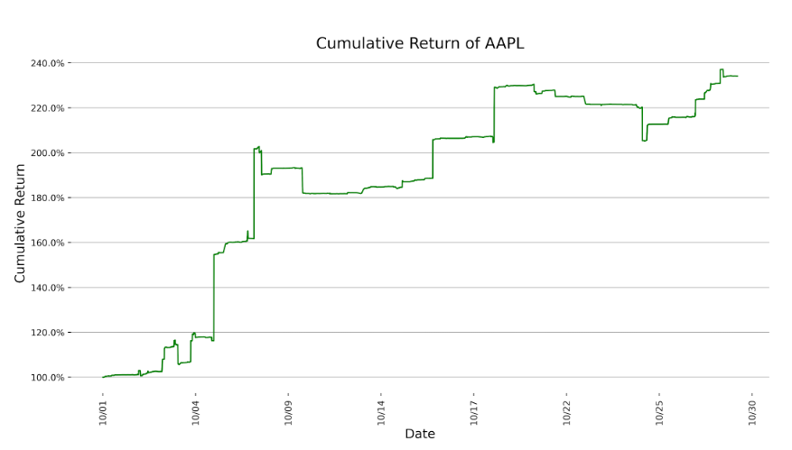
    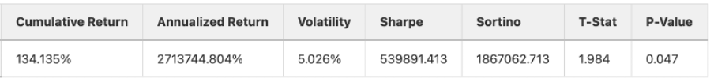
3. **INTC** :

    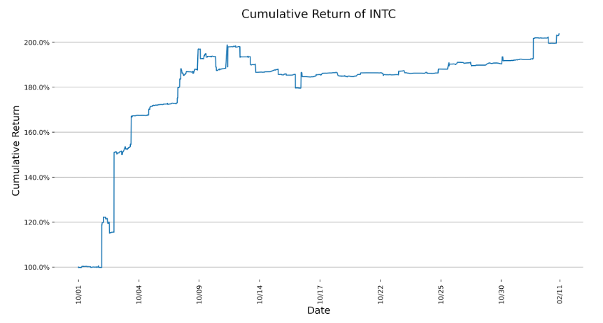
    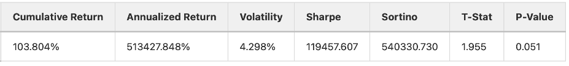
4. **JPM** :
    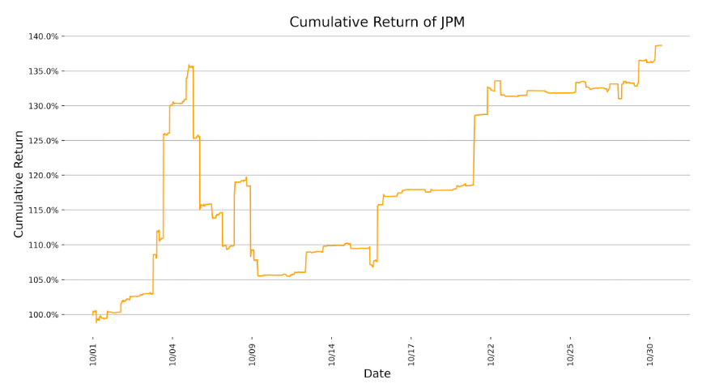
    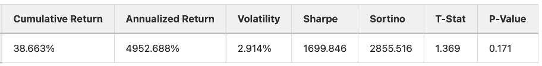

Since we are calculating the cumulative returns based on the simple return rate. There are two types of factors that can generate the cumulative return, which is how fast the transaction can be made, and how much the profit each transaction is.

The speed of the transaction is related to the efficiency of the pair signal we use. If the signal on SPY happens many times, the transaction will be many as well. 
How much profit one transaction can make is related to the effectiveness of the signal we used. If such a signal is very useful, we may generate large simple return rate from it.

From the 4 results, we get the conclusion that the simple return rate on MSFT and AAPL generated by SPY signal is significantly different from zero, in which their p-value is less than 0.05.
The cumulative return is the whole dataset time period cumulative return rate. For MSFT, the cumulative return in 2019 Oct is 97.507%, which means if we use the compounded way to do the trade at the beginning of Oct 2019, we are very likely to double our assets at the end of Oct 2019.

And for AAPL, the cumulative return rate is even larger than MSFT. However, it’s still unclear for us to say such return is from the stock itself or from the things that we generate from SPY signals. We do the following pair analysis.

---
**NOTE**
For all sections and plots below, SPY2COMP means our strategy generates signals from SPY and trade on components. Similarly, SPY2SPY means generate signals from SPY and trade on SPY; COMP2SPY means to generate signals from components and trade on SPY in the sequel. 
___

Few other analyses that were carried out are as follows.

1. ### Number of Trades:

    For the following plots, the x axis refers to the timeseries axis, and hence refer to individual days in the month of October, October 1st to October 31st 2019.

    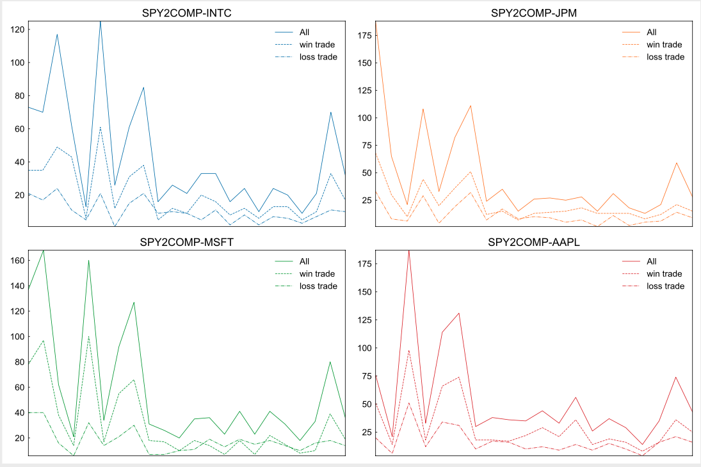

2. ### PnL by time and date

    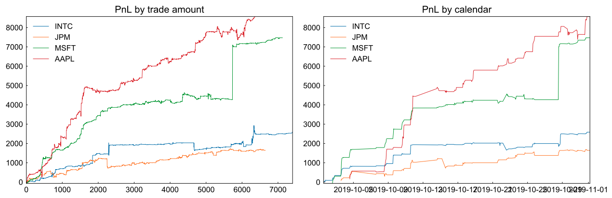

3. ### Histogram of Profit and Loss Per Trade

    Here the y axis is simply the quantity, since this is a histogram plot, and the x axis is the profit or loss occurred on every trade for the specific component. As mentioned before SPY2COMP merely denotes that we used SPY to predict future returns of the component and hence we traded on the component as specified in the plot title.

    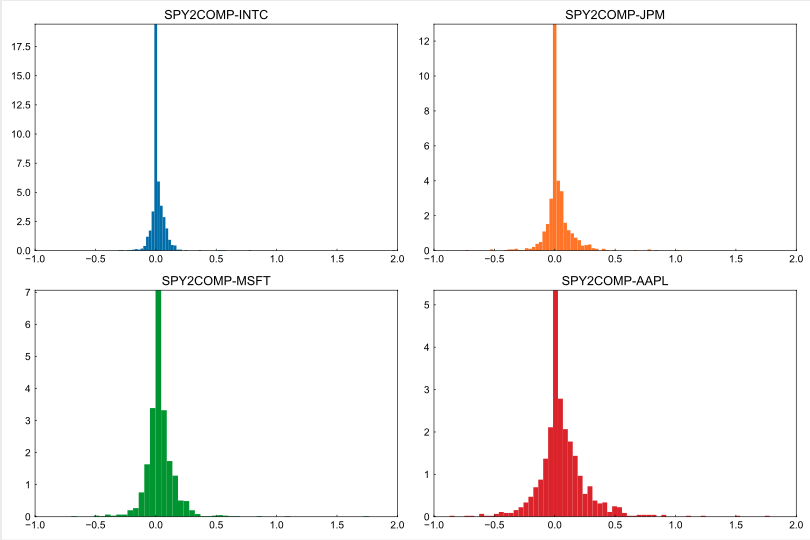

## Complementary Analysis: What is the source of profitability?

Even if our strategy successfully makes money for all the tickers during the backtesting period, prudential readers may ask where the profitability comes from. We were also haunted by this question, so we designed and conducted a series of control experiments to find out the source of profitability.  We present the logic and results in this section. 

Recall that our strategy buys the components when SPY moves up and sells components when SPY moves down. Not surprisingly, our strategy is tied to a broad family of trading strategies: momentum strategy. The difference here is that we generate signals from a different ticker. However, in the extreme case of perfectly correlation, namely, signal ticker and trade ticker move perfectly together, the difference fades out: generating signals from either ticker makes no difference at all. As we mentioned above, our strategy potentially benefits from the strong correlation between SPY and its components, so it is possible that our strategy is equivalent to a momentum strategy to some extent. It is extensively documented that trading on momentum can generate profits in many cases. We wondered whether the momentum is the source of the profitability. 

In order to answer the question, we first define a few useful terminologies for following analysis. First, we call the ticker where we generate signal ‘Signal’ ticker, while the ticker we trade on, as the ‘trade ticker’. As for the source of the profitability, we define the momentum effect as the ‘phenomenon’ that price changes due to momentum. Moreover, we use the leading effect to represent the asynchronous response between SPY and components. It's worth stressing here that the momentum effect is different from the leading effect. For example, suppose SPY moves up but MSFT drops down at 9:00am, momentum effect implies MSFT drops down at 9:01am as well, whereas leading effect predicts MSFT goes up at 9:01am.  

Our strategy is designed with the leading effect in mind, but it could be compromised or enhanced by momentum effect. Ideally, we can find the source of profitability by separating out the profits generated by momentum effect and leading effect. The idea is simple and straightforward. Note that generating signals from SPY and trade on components is an imperfect momentum trade since the correlation might vary. Instead, generating signals from components directly leads to perfect and pure momentum trade, and therefore the profits come from momentum effects with no doubt. Furthermore, the difference between our strategy and perfect momentum trade should be a good proxy for the leading effect. In an extreme case, if a pure momentum trade loses money, how come the profit of our strategy comes from momentum effect? 

Based on the above logic, we further make use of component tickers to generate signals instead of SPY, and trade on components. We plot the PnL by tickers as follows. The dash lines represent PnL generated from pure momentum trades, and solid lines represent PnL of our strategy. As shown clearly, our strategy outperforms pure momentum strategy on INTC, MSFT and AAPL by quite large margins. More saliently, pure momentum trades barely make money and even lose money on AAPL. The results suggest that the profitability of our strategy mainly, if not all, comes from the leading effect. 

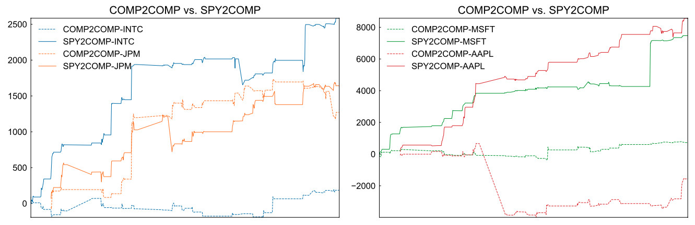

Another interesting question is whether the leading effect is of single direction. Our regression results imply the reverse leading effect (from component to SPY) is weak, but not none. Reverse leading effect is also very intuitive in the sense that components might respond faster to the firm-specific shock. To answer this question, we further run the strategy that trades on SPY but generates signals from components. We compare the results with benchmark strategy as follows.

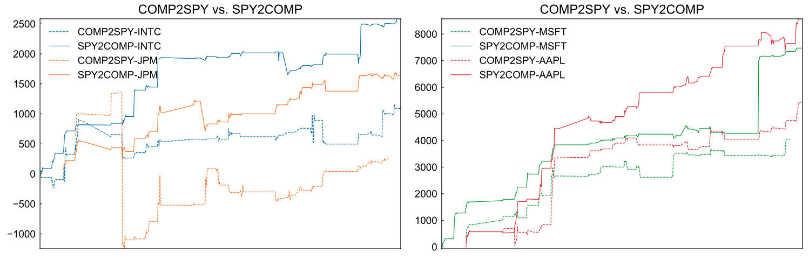

As shown in the plots, both strategies make money, suggesting the leading effect exists in both directions. However, we observe that our strategy generates higher PnL on all of the 4 components, which implies the leading effect is stronger than its reverse version. Existence of a two-direction leading effect also points out the potentials for future improvement: one could trade on both directions, or design effective logic to switch direction intelligently. 

# Conclusion:

Under the ideal circumstance, it’s possible that our strategy made money on AAPL, MSFT, INTC, and JPM.
And when we take a look at the simple rate of return result, we notice the p value for AAPL and MSFT are less than 0.05, which means the SPY signals that can generate significantly different than zero simple rate of return in AAPL and MSFT.

# Troubleshooting

a.	Yong Xie. 
  1.	Analysis tools to general signals. I found it hard to find proper tools to generate signals in the first place, due to the rarity of high-frequency data. I tried correlation plots but found it not as informative as I thought. I tested different ideas and finally settled on regression analysis. 

  2.	Time window selections. I used to use longer time windows than those shown in this report, hoping to trade at much lower frequency. Then I followed professor Lariviere’s advice to use shorter time windows and obtained better predictive performance. Shorter time window also leads to more trade and higher PnL. But still, how short the time window should be, I analyzed the distribution of trade intervals and found 1 second seems to be a good option and settled down on it. 

  3.	Event time window vs. calendar time window. When implementing the strategy, I faced the choice to calculate the return based on calendar time or event time. I wanted to use calendar time in the first place but found it hard to code. Then I switched to event time, so that I calculated historical returns of certain trades. It turns out that it is probably a better choice since event time is more adaptive to trade frequency. On the contrary, return of a calendar time can be outdated when trades occur frequently. 
  iv.	Portfolio analysis. I found PnL is too limited for portfolio analysis, so I did some research and chose to calculate other metrics that suit high-frequency trading. I calculated winning rate, losing rate, average winning PnL, average losing PnL, I also analyzed the distribution of trade throughout the backtesting periods. The results complete the profiles of our strategy.

b.	Running backtesting on a sample strategy - Seems like the username and group name in the .h file were not correctly set from the default. Caused the backtesting server to segfault

c.	Certain symbols on some specific days cause segmentation faults for reasons unknown, we haven’ t been able to narrow down the reason for this issue.

# Contributions and Next Steps

1.	Khavya Chandrasekaran (6 closed issues; 12 commits):

    a.	Created time series plots and correlation for the five highest weighted components in SPY and DIA

    b.	Conducted regression between SPY and AAPL for different time windows (24 trading days). Tried to complete the scatter plots but couldn’t complete it since it looked like box plots.

    c.	Improved the microsecond level regression by filtering the unchanged prices

    d.	Calculated the cumulative returns, Sharpe ratio, Sortino ratio and other parameters for the backtest results on AAPL, INTC and JPM
    
    e.	Report contribution: Background, correlation and time series plot, regression of short time window and microseconds regression on AAPL, backtest results on cumulative return

2.	Xuehui (Alice) Chao (6 closed issues; 10 commits)

    a.	Conducted regression and heatmap based on 30 components of DJX and DJX 30 days dataset

    b.	Conducted correlation and heatmap based on JPM and INTC and SPY 30 days dataset

    c.	Conducted regression among JPM, INTC on SPY with or without filtering the unchanged price movement based on microseconds time interval.

    d.	Create the matrix to analyze the backtesting result, draw the cumulative return plot of MSFT and calculate the Sharpe ratio and sortino ratio

    e.	Report contribution: backtesting result first part, microseconds regression JPM and INTC

3.	Kushal Goenka (14 closed issues; 30+)
    a.	Preliminary analysis and heatmaps against SPY

    b.	Created the basic framework for our strategy, involving the finite state machine (FSM), and trading logic

    c.	Ran parameter tuning on parameters such as absolute thresholds, aggressiveness, number of historical trades to factor into the decision making etc. Generated plots for the same

    d.	Ran backtesting and generated plots for the new Q1 2020 Data

    e.	Created an automation script to simplify and speed up backtesting of our strategy, allowing us to make modifications and quickly run the tests with a shell script to analyse results

    f.	General cleanup / presentation slides / project readme / issue management etc.
4.	Yong Xie (10 closed issues; 25 commits):
    a.	Conducted SPY-components correlation analysis

    a.	Wrote the main code for regression analysis and conduct part of regression analysis

    b.	Conducted trade interval analysis

    c.	Optimized and revised strategy implementation.

    d.	Conducted part of portfolio analysis, including PnL plots, winning rate, losing rate, average winning PnL, average losing PnL and trade distribution.

    e.	Conducted complement backtesting to analyze the source of profitability.  

    f.	Report contribution: strategy distribution,  regression description, regression of long time window, trade interval analysis, complement analysis: source of profitability. 
    Last one - no experience on C++. I googled a lot. Individual Contributions

# References

1.	https://www.investopedia.com/terms/e/etf.asp

