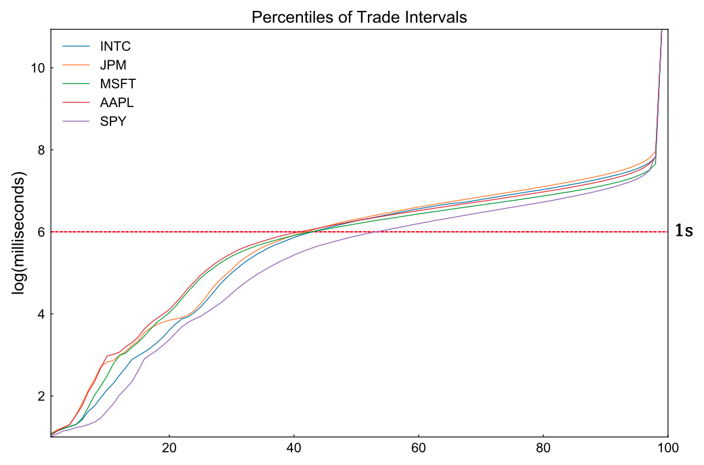

# FIN 566 Algorithmic Trading Final Report

# Table of Contents

- [FIN 566 Algorithmic Trading Final Report](#fin-566-algorithmic-trading-final-report)
- [Table of Contents](#table-of-contents)
- [Introduction](#introduction)
- [Background](#background)
  - [Glossary of Terms](#glossary-of-terms)
  - [Components and Symbols Chosen](#components-and-symbols-chosen)
  - [Description of the Data Used](#description-of-the-data-used)
- [Implementation and Analysis](#implementation-and-analysis)
  - [General Overview of Our Strategy](#general-overview-of-our-strategy)
  - [Pre-Implementation Research](#pre-implementation-research)
    - [Correlation Plots](#correlation-plots)
    - [Time Series Plots](#time-series-plots)
    - [Analysing Trade Intervals for Consecutive Trades](#analysing-trade-intervals-for-consecutive-trades)
    - [Regression Results](#regression-results)
  - [C++ Implementation:](#c-implementation)
  - [Post-Backtesting analaysis](#post-backtesting-analaysis)
- [Troubleshooting](#troubleshooting)
- [Contributions and Next Steps](#contributions-and-next-steps)
- [References](#references)

# Introduction

In our final project, we attempt to devise a trading strategy that we can backtest on real market data from a stock exchange. In the following report, we go through the different steps involved in the process, from analyzing the raw market data, looking at correlations between different stocks and finally coming up with, and implementing a trading strategy. We used a popular backtesting engine, strategy studio, to write and test our strategy.

# Background

## Glossary of Terms

Below are a cumulative list of technical terms and abbreviations that is seen in this report with a brief overview and history of the specifed term.

1. **Index**: An index is a method to track the performance of some group of assets in a standardized way. Indices typically measure the performance of a basket of securities intended to replicate a certain area of the market. These may be broad-based to capture the entire market such as the Standard & Poor's 500 (S&P 500), National Association of Securities Dealers Automated Quotations (NASDAQ) or Dow Jones Industrial Average (DJIA), or more specialized such as indices that track a particular industry or segment.
2. **ETF**: An exchange traded fund is a type of security that involves a collection of securities - such as stocks (all of the shares into which ownership of the corporation is divided), commodities, or bonds (an instrument of indebtedness of the bond issuer to the holders.), that tracks an underlying index , although they can invest in any number of industry sectors or use various strategies. ETFs are in many ways similar to mutual funds; however, they are listed on exchanges and ETF shares trade throughout the day just like ordinary stock. ETFs offer low expense ratios (expense ratio of a stock or asset fund is the total percentage of fund assets used for administrative, management, advertising, and all other expenses) and fewer broker commissions than buying the stocks individually. The ETF we have used here for our strategy is SPY that tracks the S&P 500 index. There are many other ETFs like DIA that tracks the Dow Jones index, QQQ that tracks the NASDAQ index, etc.

3. **Backtesting**:

## Components and Symbols Chosen

Our analysis and strategy involved the following tickers: 

1. SPY (S&P 500 ETF)
2. AAPL (Apple Inc.,)
3. MSFT (Microsoft Corporation)
4. JPM (JP Morgan Chase & Co.)
5. INTC (Intel Corporation).

## Description of the Data Used

Our input data consisted of the following columns: collection_time, source_time, sequence_number, tick_type, market_center (the exchange on which the trading happens - we use data from IEX so the market_center is always IEX), price (the last trading price of the stock or index or ETF), size and ticker.

We used data for the month of October 2019 to train, devise, and analyze our strategy. To further confirm that our strategy does indeed work and was not overfit on the training data, we ran multiple backtests on trading data from Q1 of 2020. (January, February, March)

# Implementation and Analysis

## General Overview of Our Strategy

Our proposed strategy takes advantage of the complementary movement between an index’s ETF and its components. It resembles the so-called pair trading strategy, generating profits from the statistical correlation and causal relationships between an index’s ETF and its components. The main advantage of an ETF-component pair is that both instruments represent the value of the same assets, and a result, leads to strong correlations between price movements. More specifically, we select an ETF which tracks the S&P 500 (ticker symbol: SPY) and its top components as the symbols to trade on. Compared with other indices, S&P 500 and its ETF are one of the most liquid and most-cited market indices. Since it is a cap-weight index, equities of large market capitalization have stronger influence on the index values, leading to stronger correlations. By the same logic, small-cap companies are less weighted and thus bear weaker influence on the index.

Ideally, since an ETF represents the values of a set of underlying assets, the value of the ETF and components’ price should move simultaneously. Even in an imperfect market, one may expect the components to respond to new information faster than the ETF does, since an ETF is nothing but a basket of component stocks. However, counterintuitively, it is well observed that index ETF, especially the most liquid ones, usually responds first with any new information. In other words, the ETF acts as a leading indicator for its components, instead of the other way around. 

The existence of this leading effect makes our strategy different from common pair trading, where traders monetize deviations in price of the pairs in both-direction. However, we monetize the leading effect of the ETF on its components. Our analysis shows ETF’s price is an effective short-term predictor for prices of its top components. More specially, the upward movements in an ETF are statistically followed by upward movement of its top components. So are the downward movements. Our proposed strategy is based on such a leading effect: we build long positions on components when we observe the ETF goes up by a tuned threshold value, wait for components to catch up and then liquidate the position. The same logic applies to the downward situation. 

The backtest results verify our analysis and show our strategy is a money maker under our ideal backtesting environment. Although our backtesting environment is unrealistic and doesn’t control all of the practical issues in the real world, the results clearly demonstrate the existence of such leading effects and point out the future direction on related real-world trading strategies. 

## Pre-Implementation Research

### Correlation Plots

Correlations of different components (AAPL, AMZN, MSFT, JPM, INTC, SPY) with each other is as follows:

We selected all components in this correlation except AMZN as it has less correlation with the others and also since it’s not one of the highest weighted components of SPY.

### Time Series Plots

Time Series plot of each ticker was done separately. We chose the five highest weighted components of SPY. The five tickers used for this plot are: AAPL, AMZN, INTC, JPM and MSFT. The plot is as follows:

From the above plot, we can see that AAPL, JPM and SPY closely mimic each other, whereas the others do not have much closeness according to the plot. Our plot from correlation also confirm that AAPL and SPY are closely related.

### Analysing Trade Intervals for Consecutive Trades

Although our aim is to predict future price movement, the issue is the time span. As such, before diving into intriguing prediction analysis, we first analyze the time interval between two consecutive trades, which provide useful information on the frequency of trade. We rely on the analysis in this section to help us choose the proper time window for future return and historical returns in the next section. To proceed, we calculate the time interval between two consecutive trades for the whole sample period and different tickers. We summarize the information by plotting out the percentiles of resulting time intervals. The result is as follows. 

As shown in the results, roughly 40% of two consecutive trades of 4 components occur within 1 second, and 55% consecutive trades of SPY occur within 1 second. Within 1 second, only 30% of trades occur within 0.1 second, and the number of qualified trades decrease steadily as time interval shortens. On the contrary, the number of trades decreases much faster beyond 1 second. The results imply the trades are clustering, traders trade actively when there are opportunities, but can keep silent for long time periods. 

$$ ALERT: ADD IMAGE HERE$$$

### Regression Results

We make use of the statistical tool of regression to analyze the correlation between SPY’s movement and components’ movement. The aim of the regression analysis is to test whether historical price movement of SPY could predict the future price movement of its components. If the leading effect exists between SPY and its components, we expect to observe that the historical return of SPY is able to predict components’ future return in a consistent and persistent manner. 
The regression can be conducted with off-the-shelf toolkits. The issue remains is the choice of the time span of historical returns (features, independent variables) and future return (label, dependent variable). First of all, we would like to predict the short-term future return, since we want to liquidize the position and take the profit quickly. Holding the position for a longer time means less trade, or more principal. Usually, the time window of the features and labels should match to obtain the strongest prediction performance. According to analysis of trade intervals, extremely short time windows lead to the problem of collinearity, since it is highly possible that no trade occurs within all the selected windows. On the other hand, a longer time-window usually doesn’t have strong predictability on the short-term return. Based on the trade interval analysis and above logic, we choose two sets of features and labels to run the regression:

-  Long time window: future return in 1 seconds as label; historical returns for 1, 5, 10, 30 seconds as features.

-  Short time window: future return in 1 millisecond as label; historical returns for 1, 5, 10, 30 microseconds as features (data - the whole month)

1. **Long-Time Window**: 
   For the regression on the long-time window, we make use components’ 1-second future return as dependent variable. As for independent variables, we use both components’ and SPY’s historical returns of 1, 5, 10, 30 seconds. The results are compiled in the following table.
   
    As shown in the table, historical returns of SPY show strong and significant predictability for components’ future return in all of the 4 regressions. Even surprisingly, the coefficients are even larger than the component’s themselves. The results suggest that SPY’s historical returns are good predictors of components’ future performance, at least for the 1-second time span. For the sake of clarity, we only compile the regression results for one day, but we found the results are consistent and persistent during the whole month. 

    $$ ALERT: ADD TABLE HERE$$$

2. **Short Time Window**:
     -  **(0.001 seconds)**:

        $$ ALERT: ADD TABLE HERE$$$
    -  **(0.000001 seconds) Microseconds**:
        1. AAPL:

        $$ ALERT: ADD TABLE HERE$$$

## C++ Implementation:

## Post-Backtesting analaysis

# Troubleshooting

# Contributions and Next Steps

# References

